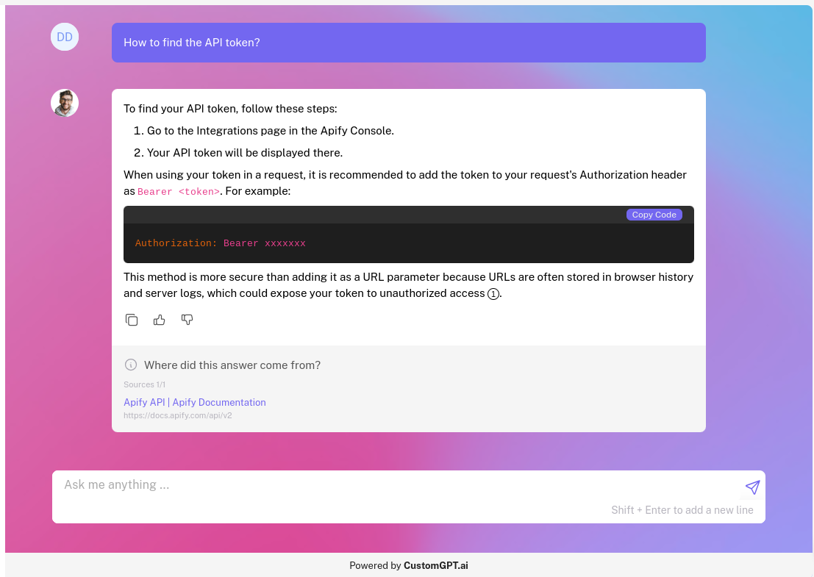

# Apify-CustomGPT Integration

[](https://opensource.org/licenses/MIT)
[](https://www.python.org/downloads/)

A powerful tool to scrape web content using Apify and create AI agents with CustomGPT, enabling you to build intelligent chatbots based on web data.

## Table of Contents
- [Features](#features)
- [Prerequisites](#prerequisites)
- [Installation](#installation)
- [Usage](#usage)
- [Configuration](#configuration)
- [Code Structure](#code-structure)
- [Contributing](#contributing)
- [License](#license)
- [Support](#support)

## Features

- 🕷️ Web scraping using Apify's website content crawler
- 🤖 AI agent creation with CustomGPT
- 🔄 Automatic transfer of scraped data to CustomGPT
- 📊 Indexing status monitoring
- 💬 Immediate chat functionality with the created AI agent



## Prerequisites

Before you begin, ensure you have met the following requirements:

- Python 3.7 or higher
- An Apify account with API access
- A CustomGPT account with API access

## Installation

1. Clone the repository:
   ```
   git clone https://github.com/adorosario/apify-customgpt.git
   cd apify-customgpt
   ```

2. Install the required dependencies:
   ```
   pip install -r requirements.txt
   ```

## Usage

1. Set up your environment variables by creating a `.env` file in the root directory:
   ```
   APIFY_API_TOKEN=your_apify_api_token
   CUSTOMGPT_API_KEY=your_customgpt_api_key
   ```

2. Run the script with the required arguments:
   ```
   python main.py --starting-url <URL> --prompt <prompt>
   ```
   Replace `<URL>` with the website you want to scrape and `<prompt>` with the initial question for your AI agent.

3. Monitor the console output for progress updates and the final AI agent response.

## Configuration

### Apify Setup

1. Sign up for an [Apify account](https://console.apify.com/).
2. Navigate to your account settings.
3. Find your API token in the Integrations section.
4. Use this API token in your `.env` file.

### CustomGPT Setup

1. Log in to your [CustomGPT account](https://app.customgpt.ai/).
2. Navigate to your profile settings.
3. Find your API key in the API section.
4. Use this API key in your `.env` file.

## Code Structure

- `main.py`: The main script that orchestrates the web scraping and AI agent creation process.
- `requirements.txt`: List of Python dependencies.
- `.env`: File for storing environment variables (not included in the repository).

Key functions in `main.py`:
- `generate_project_name()`: Creates a unique project name based on the URL and timestamp.
- `transfer_to_customgpt()`: Transfers scraped data to CustomGPT.
- `check_indexing_status()`: Monitors the indexing status of transferred documents.
- `query_customgpt()`: Sends a query to the created AI agent and retrieves the response.

## Contributing

Contributions to the Apify-CustomGPT Integration project are welcome! Here's how you can contribute:

1. Fork the repository.
2. Create a new branch: `git checkout -b feature-branch-name`.
3. Make your changes and commit them: `git commit -m 'Add some feature'`.
4. Push to the branch: `git push origin feature-branch-name`.
5. Create a pull request.

Please ensure your code adheres to the project's coding standards and include tests for new features.

## License

This project is licensed under the [MIT License](https://opensource.org/licenses/MIT).

## Support

If you encounter any problems or have any questions, please open an issue in the GitHub repository or contact the maintainers directly.

---

Made with ❤️ by [adorosario](https://github.com/adorosario)
